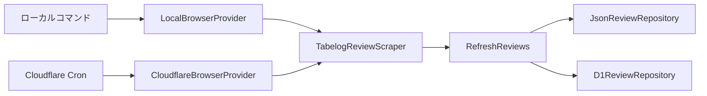

# Tabelog Writer

本人が食べログへ投稿した口コミを収集し、過去の文体を参考に新しい口コミの下書きを生成する個人用アプリです。

- 画面：React、Vite、Tailwind CSS、daisyUI
- API：TypeScript、Hono、Cloudflare Workers
- 口コミ収集：Playwright、Cloudflare Browser Run
- 保存：Cloudflare D1
- 文章生成：Cloudflare Workers AI

## 口コミの取得項目

| 項目 | 型 | 内容 |
| --- | --- | --- |
| `id` | `string` | 口コミ詳細URL由来のID |
| `name` | `string` | 店舗名 |
| `url` | `string` | 店舗ページURL |
| `detailUrl` | `string` | 口コミ詳細URL |
| `title` | `string \| null` | 口コミタイトル |
| `body` | `string \| null` | 省略されていない口コミ本文 |
| `reviewDate` | `string` | 訪問年月。`YYYY-MM`形式 |
| `rating` | `number` | 投稿者が付けた点数 |
| `likeCount` | `number` | 口コミへのいいね数 |

食べログが公開している日付は訪問年月までのため、存在しない日を補完しません。

## スクレイピング構成

食べログの巡回・抽出処理は、ローカルとCloudflareで共通です。ブラウザーの起動方法と保存先だけをコンストラクタインジェクションで切り替えます。



| 実行環境 | ブラウザー | 保存先 |
| --- | --- | --- |
| ローカルコマンド | ローカルChrome | `data/reviews.json` |
| Cloudflare Worker | Browser Run | D1 |

本番の口コミ一覧APIと文章生成処理はD1を参照します。JSONはローカルスクレイパーの確認・バックアップ用であり、本番Workerへ埋め込みません。

## セットアップ

```bash
npm install
npx wrangler d1 migrations apply tabelog-writer-db --local
```

`.dev.vars`を作成し、Workers AIをローカルから利用するための値を設定します。

```text
AI_TRANSPORT="rest"
CLOUDFLARE_ACCOUNT_ID="CloudflareのAccount ID"
CLOUDFLARE_AI_API_TOKEN="Workers AI API Token"
```

Browser Runは`wrangler.jsonc`でリモートバインディングとして設定されています。ローカルからBrowser Runを実行した場合もCloudflare側の利用量に加算されます。

## ローカルChromeで口コミを取得

```bash
npm run scrape
```

通常のChromeを起動して口コミを取得し、次のファイルへ保存します。

```text
data/reviews.json
data/reviews-meta.json
```

このコマンドはD1や本番環境を更新しません。

## アプリのローカル起動

```bash
npm run dev
```

表示されたURLを開きます。口コミ一覧と文章生成の参考文はローカルD1から読み取ります。

## Browser Runのローカル検証

Browser Runを含むScheduled Handlerの検証には、Wranglerの開発サーバーを使用します。

```bash
npm run dev:worker
```

別のターミナルからScheduled Handlerを呼び出します。

```bash
curl "http://localhost:8787/cdn-cgi/handler/scheduled"
```

`npm run dev`で起動するVite開発サーバーは、通常の画面・API開発に使用します。リモートのBrowser Runを伴うCron検証には使用しません。

この処理は次の順序で動作します。

1. Browser Runでブラウザーを起動する
2. 食べログの一覧と詳細ページを巡回する
3. 取得結果をD1のトランザクションで全件入れ替える
4. 最終更新日時を保存する

処理途中で失敗した場合、D1の既存口コミは置き換わりません。

## 定期実行

Cron Triggerは毎日03:00（日本時間）に実行します。

```json
{
  "triggers": {
    "crons": ["0 18 * * *"]
  }
}
```

CloudflareのCron式はUTC基準なので、18:00 UTCが翌日03:00 JSTに当たります。

## ビルドとデプロイ

初回またはマイグレーション追加時は、Workerより先にリモートD1へ適用します。

```bash
npx wrangler d1 migrations apply tabelog-writer-db --remote
npm run build
npm run deploy
```

デプロイ後はCron TriggerがBrowser Runを起動し、取得した口コミをリモートD1へ保存します。

## 主なファイル

```text
.
├── migrations/
│   ├── 0001_initial_schema.sql
│   └── 0002_scraped_reviews.sql
├── scripts/
│   ├── scrape-tabelog.ts
│   ├── local-browser-provider.ts
│   └── json-review-repository.ts
├── src/
│   ├── scraping/
│   │   ├── browser-provider.ts
│   │   ├── review-repository.ts
│   │   ├── tabelog-review-scraper.ts
│   │   └── refresh-reviews.ts
│   ├── react-app/
│   └── worker/
│       ├── cloudflare-browser-provider.ts
│       ├── d1-review-repository.ts
│       ├── create-refresh-reviews.ts
│       └── index.ts
├── wrangler.jsonc
└── package.json
```

## エラーとして停止する条件

- ページ取得時のHTTPステータスが正常でない
- 一覧から口コミ情報を取得できない
- 訪問年月が`YYYY/MM 訪問`形式ではない
- 点数またはいいね数を数値へ変換できない
- 全投稿でいいね要素が見つからない
- D1への一括保存が失敗する

食べログ側のHTML構造変更を空データとして保存せず、既存データを維持するための条件です。

## 注意事項

- 食べログ側のHTML構造が変わると、CSSセレクターの修正が必要です。
- Browser RunからのアクセスはBotとして識別されます。対象サイトの判断により取得できなくなる可能性があります。
- 実行頻度、取得データの範囲、利用方法について対象サイトの利用条件を確認してください。
- Browser RunとWorkers AIの利用量はCloudflareダッシュボードで確認してください。
